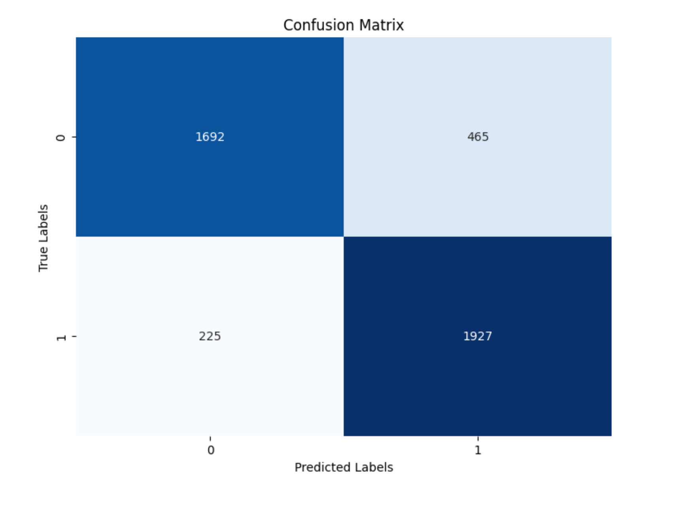

# Predicting League of Legends Results with different models

by Ahmed Mostafa and Ethan Vo (ahmostafa@ucsd.edu, etvo@ucsd.edu)

If you would like to look at out previous project where we analyzed League of Legends kills on winrate look here: <a href="https://ahmostafa147.github.io/dsc80-project/">League of Legends Kill Analysis</a>.

---

## Introduction

Our dataset is on all of the professional League of Legends games that have taken place in 2023. The dataset contains 12 rows per game, one row per player and 2 rows of summary statistics (one for each team). Furthermore, there are over 100 columns of nearly all the data you could collect on a league of legends match. Our question is “Given support data predict whether the support will win or lose?” Addressing this question would help predict the result of a game given a support player's game statistics and support players determine which aspects of the game they need to focus on in order to win. Although the data does not explicitly collect information on whether a player has more kills than a lane opponent, we can collect the data from columns “kills”, “positions”, and “side”  to compare the kills of a player and their lane opponent and make our own column “has_more_kills.”

The columns we are interested in to answer, “Given support data predict whether the support will win or lose?” are: <code class="language-plaintext highlighter-rouge">“gameid”</code>, <code class="language-plaintext highlighter-rouge">“side”</code>, <code class="language-plaintext highlighter-rouge">“champion”</code>, <code class="language-plaintext highlighter-rouge">“position”</code>, <code class="language-plaintext highlighter-rouge">“result”</code>, <code class="language-plaintext highlighter-rouge">“kills”</code>, <code class="language-plaintext highlighter-rouge">“teamkills”</code>, and <code class="language-plaintext highlighter-rouge">“damageshare”</code>. These are the columns from the dataset that are relevant to our proposed question, as they provide us with information about the position, the side they belong to, whether the position won or lost, and the number of kills done by each position. In the process of cleaning, we removed rows that belong to the team, as they were irrelevant to our analysis, and sorted the data to have each position next to its opponent for easier visual comparison. After that, we decided to add the boolean column, <code class="language-plaintext highlighter-rouge">“has_more_kills”</code>, where True means the position had more kills, and False otherwise. From there we only kept the rows that had a 'position' of 'support'. The column was added to simplify the analysis and comparison process. After cleaning, our dataframe had 21544 rows, representing 21544 supports, and 9 columns.

Descriptions of Columns

* <code class="language-plaintext highlighter-rouge">"gameid"</code> is the identification number of the particular game from that tournament. This is unique for all games in the dataset
* <code class="language-plaintext highlighter-rouge">"side"</code> is the side that player played on. This can either be red or blue (corresponding to the red and blue sides on the map for League of Legends)
* <code class="language-plaintext highlighter-rouge">“position”</code> is the position or role the player played. This can be “top”, “mid”, “bot”, “jng”, or “sup” for the five positions in League of Legends
* <code class="language-plaintext highlighter-rouge">"champion"</code> is the champion that the player selected for that game.
* <code class="language-plaintext highlighter-rouge">“result”</code> is whether or not the team won. It will be 1 if the player’s team won or 0 for a loss
* <code class="language-plaintext highlighter-rouge">"kills"</code> is the number of kills that particular player got in that game
* <code class="language-plaintext highlighter-rouge">“teamkills”</code> is the total number of kills a player's team got
* <code class="language-plaintext highlighter-rouge">“damageshare”</code> is the proportion of the team's damage that player dealt
* <code class="language-plaintext highlighter-rouge">“has_more_kills”</code> states whether or not the player has more kills than their lane opponent. It is a boolean that returns either “True” or “False”

Below is the first 5 rows of the dataframe with the columns we needed:

|    | gameid                | side   | position   | champion   |   result |   kills |   teamkills |   damageshare |
|---:|:----------------------|:-------|:-----------|:-----------|---------:|--------:|------------:|--------------:|
|  0 | ESPORTSTMNT06_2753012 | Blue   | top        | Jax        |        1 |       4 |          13 |     0.150027  |
|  1 | ESPORTSTMNT06_2753012 | Blue   | jng        | Poppy      |        1 |       2 |          13 |     0.0653236 |
|  2 | ESPORTSTMNT06_2753012 | Blue   | mid        | Taliyah    |        1 |       2 |          13 |     0.283899  |
|  3 | ESPORTSTMNT06_2753012 | Blue   | bot        | Ezreal     |        1 |       5 |          13 |     0.441215  |
|  4 | ESPORTSTMNT06_2753012 | Blue   | sup        | Karma      |        1 |       0 |          13 |     0.0595359 |

Below are the first 5 rows of the cleaned dataframe:

| side   | champion   |   result |   teamkills |   damageshare | has_more_kills   |
|:-------|:-----------|---------:|------------:|--------------:|:-----------------|
| Red    | Alistar    |        1 |          21 |     0.0380566 | False            |
| Blue   | Nautilus   |        0 |           4 |     0.10302   | False            |
| Red    | Tahm Kench |        0 |           9 |     0.121665  | True             |
| Blue   | Rakan      |        1 |          27 |     0.0634818 | False            |
| Red    | Rakan      |        1 |          29 |     0.0751361 | False            |

## Problem Identification
Our prediction problem is trying to predict whether a support player won their game of League of Legends, given only their post game statistics (without the result). Note that we do not include the results of the any other player in each game in our analysis, as we want to focus on only the support's statistics. This is a binary classification problem, with the two outcomes being a win or a loss. Our response variable is the “result” column, which is 1 if a team won a game, and 0 otherwise. We chose this because we wanted to further explore the influence of a support's behavior on the result of a game from our previous project. We are evaluating our model through accuracy. A false positive or false negative do not really have much consequences so an F-1 score isn't as important in this context.

## Baseline Model
---
For our Baseline model we took our cleaned DataFrame and further isolated two features, one quantitative and one nominal. The features of our model are `"champion"`, meaning the selected champion, and `"damageshare"`, meaning the total kills of the team. We one-hot-encoded `"champion"`.

Below is our Dataframe that shows the first five rows of the data we used in our Final Model where we tested `"champion"` and `"damageshare"` and tried to predict `"result"`:

|    |   ohe__champion_Ahri |   ohe__champion_Alistar |   ohe__champion_Amumu |   ohe__champion_Annie |   ohe__champion_Ashe |   ohe__champion_Azir |   ohe__champion_Bard |   ohe__champion_Bel'Veth |   ohe__champion_Blitzcrank |   ohe__champion_Brand |   ohe__champion_Braum |   ohe__champion_Caitlyn |   ohe__champion_Camille |   ohe__champion_Cho'Gath |   ohe__champion_Elise |   ohe__champion_Fiddlesticks |   ohe__champion_Galio |   ohe__champion_Garen |   ohe__champion_Gnar |   ohe__champion_Gragas |   ohe__champion_Heimerdinger |   ohe__champion_Illaoi |   ohe__champion_Ivern |   ohe__champion_Janna |   ohe__champion_Jarvan IV |   ohe__champion_Jhin |   ohe__champion_K'Sante |   ohe__champion_Kalista |   ohe__champion_Karma |   ohe__champion_Karthus |   ohe__champion_Lee Sin |   ohe__champion_Leona |   ohe__champion_Lissandra |   ohe__champion_Lulu |   ohe__champion_Lux |   ohe__champion_Maokai |   ohe__champion_Master Yi |   ohe__champion_Milio |   ohe__champion_Miss Fortune |   ohe__champion_Morgana |   ohe__champion_Nami |   ohe__champion_Nasus |   ohe__champion_Nautilus |   ohe__champion_Neeko |   ohe__champion_Nunu & Willump |   ohe__champion_Olaf |   ohe__champion_Ornn |   ohe__champion_Pantheon |   ohe__champion_Poppy |   ohe__champion_Pyke |   ohe__champion_Rakan |   ohe__champion_Rek'Sai |   ohe__champion_Rell |   ohe__champion_Renata Glasc |   ohe__champion_Rengar |   ohe__champion_Rumble |   ohe__champion_Sejuani |   ohe__champion_Senna |   ohe__champion_Seraphine |   ohe__champion_Sett |   ohe__champion_Shaco |   ohe__champion_Singed |   ohe__champion_Sion |   ohe__champion_Sona |   ohe__champion_Soraka |   ohe__champion_Swain |   ohe__champion_Sylas |   ohe__champion_Tahm Kench |   ohe__champion_Taliyah |   ohe__champion_Taric |   ohe__champion_Thresh |   ohe__champion_Trundle |   ohe__champion_Twitch |   ohe__champion_Varus |   ohe__champion_Veigar |   ohe__champion_Viktor |   ohe__champion_Wukong |   ohe__champion_Xerath |   ohe__champion_Yone |   ohe__champion_Yuumi |   ohe__champion_Zac |   ohe__champion_Ziggs |   ohe__champion_Zilean |   ohe__champion_Zoe |   ohe__champion_Zyra |   remainder__damageshare |
|---:|---------------------:|------------------------:|----------------------:|----------------------:|---------------------:|---------------------:|---------------------:|-------------------------:|---------------------------:|----------------------:|----------------------:|------------------------:|------------------------:|-------------------------:|----------------------:|-----------------------------:|----------------------:|----------------------:|---------------------:|-----------------------:|-----------------------------:|-----------------------:|----------------------:|----------------------:|--------------------------:|---------------------:|------------------------:|------------------------:|----------------------:|------------------------:|------------------------:|----------------------:|--------------------------:|---------------------:|--------------------:|-----------------------:|--------------------------:|----------------------:|-----------------------------:|------------------------:|---------------------:|----------------------:|-------------------------:|----------------------:|-------------------------------:|---------------------:|---------------------:|-------------------------:|----------------------:|---------------------:|----------------------:|------------------------:|---------------------:|-----------------------------:|-----------------------:|-----------------------:|------------------------:|----------------------:|--------------------------:|---------------------:|----------------------:|-----------------------:|---------------------:|---------------------:|-----------------------:|----------------------:|----------------------:|---------------------------:|------------------------:|----------------------:|-----------------------:|------------------------:|-----------------------:|----------------------:|-----------------------:|-----------------------:|-----------------------:|-----------------------:|---------------------:|----------------------:|--------------------:|----------------------:|-----------------------:|--------------------:|---------------------:|-------------------------:|
|  0 |                    0 |                       0 |                     0 |                     0 |                    0 |                    0 |                    0 |                        0 |                          0 |                     0 |                     0 |                       0 |                       0 |                        0 |                     0 |                            0 |                     0 |                     0 |                    0 |                      0 |                            0 |                      0 |                     0 |                     0 |                         0 |                    0 |                       0 |                       0 |                     0 |                       0 |                       0 |                     0 |                         0 |                    1 |                   0 |                      0 |                         0 |                     0 |                            0 |                       0 |                    0 |                     0 |                        0 |                     0 |                              0 |                    0 |                    0 |                        0 |                     0 |                    0 |                     0 |                       0 |                    0 |                            0 |                      0 |                      0 |                       0 |                     0 |                         0 |                    0 |                     0 |                      0 |                    0 |                    0 |                      0 |                     0 |                     0 |                          0 |                       0 |                     0 |                      0 |                       0 |                      0 |                     0 |                      0 |                      0 |                      0 |                      0 |                    0 |                     0 |                   0 |                     0 |                      0 |                   0 |                    0 |                0.0906747 |
|  1 |                    0 |                       0 |                     0 |                     1 |                    0 |                    0 |                    0 |                        0 |                          0 |                     0 |                     0 |                       0 |                       0 |                        0 |                     0 |                            0 |                     0 |                     0 |                    0 |                      0 |                            0 |                      0 |                     0 |                     0 |                         0 |                    0 |                       0 |                       0 |                     0 |                       0 |                       0 |                     0 |                         0 |                    0 |                   0 |                      0 |                         0 |                     0 |                            0 |                       0 |                    0 |                     0 |                        0 |                     0 |                              0 |                    0 |                    0 |                        0 |                     0 |                    0 |                     0 |                       0 |                    0 |                            0 |                      0 |                      0 |                       0 |                     0 |                         0 |                    0 |                     0 |                      0 |                    0 |                    0 |                      0 |                     0 |                     0 |                          0 |                       0 |                     0 |                      0 |                       0 |                      0 |                     0 |                      0 |                      0 |                      0 |                      0 |                    0 |                     0 |                   0 |                     0 |                      0 |                   0 |                    0 |                0.115425  |
|  2 |                    0 |                       0 |                     0 |                     0 |                    0 |                    0 |                    0 |                        0 |                          0 |                     0 |                     0 |                       0 |                       0 |                        0 |                     0 |                            0 |                     0 |                     0 |                    0 |                      0 |                            0 |                      0 |                     0 |                     0 |                         0 |                    0 |                       0 |                       0 |                     1 |                       0 |                       0 |                     0 |                         0 |                    0 |                   0 |                      0 |                         0 |                     0 |                            0 |                       0 |                    0 |                     0 |                        0 |                     0 |                              0 |                    0 |                    0 |                        0 |                     0 |                    0 |                     0 |                       0 |                    0 |                            0 |                      0 |                      0 |                       0 |                     0 |                         0 |                    0 |                     0 |                      0 |                    0 |                    0 |                      0 |                     0 |                     0 |                          0 |                       0 |                     0 |                      0 |                       0 |                      0 |                     0 |                      0 |                      0 |                      0 |                      0 |                    0 |                     0 |                   0 |                     0 |                      0 |                   0 |                    0 |                0.17719   |
|  3 |                    0 |                       0 |                     0 |                     0 |                    0 |                    0 |                    0 |                        0 |                          0 |                     0 |                     0 |                       0 |                       0 |                        0 |                     0 |                            0 |                     0 |                     0 |                    0 |                      0 |                            0 |                      0 |                     0 |                     0 |                         0 |                    0 |                       0 |                       0 |                     0 |                       0 |                       0 |                     0 |                         0 |                    1 |                   0 |                      0 |                         0 |                     0 |                            0 |                       0 |                    0 |                     0 |                        0 |                     0 |                              0 |                    0 |                    0 |                        0 |                     0 |                    0 |                     0 |                       0 |                    0 |                            0 |                      0 |                      0 |                       0 |                     0 |                         0 |                    0 |                     0 |                      0 |                    0 |                    0 |                      0 |                     0 |                     0 |                          0 |                       0 |                     0 |                      0 |                       0 |                      0 |                     0 |                      0 |                      0 |                      0 |                      0 |                    0 |                     0 |                   0 |                     0 |                      0 |                   0 |                    0 |                0.0263977 |
|  4 |                    0 |                       0 |                     0 |                     0 |                    0 |                    0 |                    0 |                        0 |                          0 |                     0 |                     0 |                       0 |                       0 |                        0 |                     0 |                            0 |                     0 |                     0 |                    0 |                      0 |                            0 |                      0 |                     0 |                     0 |                         0 |                    0 |                       0 |                       0 |                     0 |                       0 |                       0 |                     1 |                         0 |                    0 |                   0 |                      0 |                         0 |                     0 |                            0 |                       0 |                    0 |                     0 |                        0 |                     0 |                              0 |                    0 |                    0 |                        0 |                     0 |                    0 |                     0 |                       0 |                    0 |                            0 |                      0 |                      0 |                       0 |                     0 |                         0 |                    0 |                     0 |                      0 |                    0 |                    0 |                      0 |                     0 |                     0 |                          0 |                       0 |                     0 |                      0 |                       0 |                      0 |                     0 |                      0 |                      0 |                      0 |                      0 |                    0 |                     0 |                   0 |                     0 |                      0 |                   0 |                    0 |                0.0538336 |

We chose `"champion"` and `"damageshare"` as our two features because we thought that certain champions are more successful than others in the support role, and that supports with higher damageshares of their team are more likely to lose. This is because some champions win more in a professional setting with their chemistry with other champions used in pro play. In addition, typically when a support does a greater proportion of their teams damage that means that their teammates (the ones who should be doing damage) aren't doing enough damage, and will likely mean that they're behind and losing. We one-hot-encoded `"champion"` by using OneHotEncoder(). The accuracy of this model was roughly 50%, meaning that it was accurate about half of the time. In its current state the model is not good because its accuracy is no better than flipping a coin to determine if the player will win. As a result, the model needs more features that encapsulate performance in a game, such as data related to kills. 

## Final Model
---
### Hyperparameters

The modeling algorithm we chose was a decision tree, as we have a classification problem. The hyperparameters that worked the best for our model were criterion = “gini”, max_depth = None, max_features = sqrt, min_samples_leaf = 1, min_samples_split = 50, and forest_n_estimators = 50. We found our optimal hyperparameters through a self implemented, slightly modified version of grid search. 
 
### Features

The features we added were `"has_more_kills"` and `"teamkills"`. In total we had two quantitative features, one nominal feature and one binary feature. We converted `"has_more_kills"` from a boolean to binary, and performed feature engineering on `"teamkills"` as well as `"damageshare"`. `"has_more_kills"` determines if the player had more kills than their opponenet in the same position for that game, and `"teamkills"` is the total number of kills the player's team had for that game.

Below is our Dataframe that shows the first five rows of the data we used in our Final Model where we tested `"champion"`,  `"has_more_kills"`, `"teamkills"`, and `"damageshare"` and tried to predict `"result"`:

||   ohe__champion_Ahri |   ohe__champion_Alistar |   ohe__champion_Amumu |   ohe__champion_Annie |   ohe__champion_Ashe |   ohe__champion_Azir |   ohe__champion_Bard |   ohe__champion_Bel'Veth |   ohe__champion_Blitzcrank |   ohe__champion_Brand |   ohe__champion_Braum |   ohe__champion_Caitlyn |   ohe__champion_Camille |   ohe__champion_Cho'Gath |   ohe__champion_Fiddlesticks |   ohe__champion_Galio |   ohe__champion_Garen |   ohe__champion_Gnar |   ohe__champion_Gragas |   ohe__champion_Heimerdinger |   ohe__champion_Illaoi |   ohe__champion_Janna |   ohe__champion_Jarvan IV |   ohe__champion_Jhin |   ohe__champion_K'Sante |   ohe__champion_Kalista |   ohe__champion_Karma |   ohe__champion_Karthus |   ohe__champion_Lee Sin |   ohe__champion_Leona |   ohe__champion_Lissandra |   ohe__champion_Lulu |   ohe__champion_Lux |   ohe__champion_Maokai |   ohe__champion_Master Yi |   ohe__champion_Milio |   ohe__champion_Miss Fortune |   ohe__champion_Morgana |   ohe__champion_Nami |   ohe__champion_Nasus |   ohe__champion_Nautilus |   ohe__champion_Neeko |   ohe__champion_Nunu & Willump |   ohe__champion_Olaf |   ohe__champion_Ornn |   ohe__champion_Pantheon |   ohe__champion_Poppy |   ohe__champion_Pyke |   ohe__champion_Rakan |   ohe__champion_Rek'Sai |   ohe__champion_Rell |   ohe__champion_Renata Glasc |   ohe__champion_Rengar |   ohe__champion_Rumble |   ohe__champion_Sejuani |   ohe__champion_Senna |   ohe__champion_Seraphine |   ohe__champion_Sett |   ohe__champion_Shen |   ohe__champion_Singed |   ohe__champion_Sion |   ohe__champion_Sona |   ohe__champion_Soraka |   ohe__champion_Swain |   ohe__champion_Sylas |   ohe__champion_Tahm Kench |   ohe__champion_Taliyah |   ohe__champion_Taric |   ohe__champion_Thresh |   ohe__champion_Trundle |   ohe__champion_Twitch |   ohe__champion_Varus |   ohe__champion_Viktor |   ohe__champion_Wukong |   ohe__champion_Xerath |   ohe__champion_Yone |   ohe__champion_Yuumi |   ohe__champion_Zac |   ohe__champion_Ziggs |   ohe__champion_Zilean |   ohe__champion_Zoe |   ohe__champion_Zyra |   ohe__side_Blue |   ohe__side_Red |   standarize__teamkills |   standarize__damageshare |   remainder__has_more_kills |
|---:|---------------------:|------------------------:|----------------------:|----------------------:|---------------------:|---------------------:|---------------------:|-------------------------:|---------------------------:|----------------------:|----------------------:|------------------------:|------------------------:|-------------------------:|-----------------------------:|----------------------:|----------------------:|---------------------:|-----------------------:|-----------------------------:|-----------------------:|----------------------:|--------------------------:|---------------------:|------------------------:|------------------------:|----------------------:|------------------------:|------------------------:|----------------------:|--------------------------:|---------------------:|--------------------:|-----------------------:|--------------------------:|----------------------:|-----------------------------:|------------------------:|---------------------:|----------------------:|-------------------------:|----------------------:|-------------------------------:|---------------------:|---------------------:|-------------------------:|----------------------:|---------------------:|----------------------:|------------------------:|---------------------:|-----------------------------:|-----------------------:|-----------------------:|------------------------:|----------------------:|--------------------------:|---------------------:|---------------------:|-----------------------:|---------------------:|---------------------:|-----------------------:|----------------------:|----------------------:|---------------------------:|------------------------:|----------------------:|-----------------------:|------------------------:|-----------------------:|----------------------:|-----------------------:|-----------------------:|-----------------------:|---------------------:|----------------------:|--------------------:|----------------------:|-----------------------:|--------------------:|---------------------:|-----------------:|----------------:|------------------------:|--------------------------:|----------------------------:|
|  0 |                    0 |                       0 |                     0 |                     0 |                    0 |                    0 |                    0 |                        0 |                          0 |                     0 |                     0 |                       0 |                       0 |                        0 |                            0 |                     0 |                     0 |                    0 |                      0 |                            0 |                      0 |                     0 |                         0 |                    0 |                       0 |                       0 |                     0 |                       0 |                       0 |                     0 |                         0 |                    0 |                   0 |                      0 |                         0 |                     0 |                            0 |                       0 |                    0 |                     0 |                        0 |                     0 |                              0 |                    0 |                    0 |                        0 |                     0 |                    0 |                     1 |                       0 |                    0 |                            0 |                      0 |                      0 |                       0 |                     0 |                         0 |                    0 |                    0 |                      0 |                    0 |                    0 |                      0 |                     0 |                     0 |                          0 |                       0 |                     0 |                      0 |                       0 |                      0 |                     0 |                      0 |                      0 |                      0 |                    0 |                     0 |                   0 |                     0 |                      0 |                   0 |                    0 |                1 |               0 |               -0.823143 |                 -0.255961 |                           1 |
|  1 |                    0 |                       0 |                     0 |                     0 |                    0 |                    0 |                    0 |                        0 |                          0 |                     0 |                     0 |                       0 |                       0 |                        0 |                            0 |                     0 |                     0 |                    0 |                      0 |                            0 |                      0 |                     0 |                         0 |                    0 |                       0 |                       0 |                     0 |                       0 |                       0 |                     0 |                         0 |                    0 |                   0 |                      0 |                         0 |                     0 |                            0 |                       0 |                    0 |                     0 |                        1 |                     0 |                              0 |                    0 |                    0 |                        0 |                     0 |                    0 |                     0 |                       0 |                    0 |                            0 |                      0 |                      0 |                       0 |                     0 |                         0 |                    0 |                    0 |                      0 |                    0 |                    0 |                      0 |                     0 |                     0 |                          0 |                       0 |                     0 |                      0 |                       0 |                      0 |                     0 |                      0 |                      0 |                      0 |                    0 |                     0 |                   0 |                     0 |                      0 |                   0 |                    0 |                1 |               0 |               -0.958537 |                 -0.338584 |                           0 |
|  2 |                    0 |                       1 |                     0 |                     0 |                    0 |                    0 |                    0 |                        0 |                          0 |                     0 |                     0 |                       0 |                       0 |                        0 |                            0 |                     0 |                     0 |                    0 |                      0 |                            0 |                      0 |                     0 |                         0 |                    0 |                       0 |                       0 |                     0 |                       0 |                       0 |                     0 |                         0 |                    0 |                   0 |                      0 |                         0 |                     0 |                            0 |                       0 |                    0 |                     0 |                        0 |                     0 |                              0 |                    0 |                    0 |                        0 |                     0 |                    0 |                     0 |                       0 |                    0 |                            0 |                      0 |                      0 |                       0 |                     0 |                         0 |                    0 |                    0 |                      0 |                    0 |                    0 |                      0 |                     0 |                     0 |                          0 |                       0 |                     0 |                      0 |                       0 |                      0 |                     0 |                      0 |                      0 |                      0 |                    0 |                     0 |                   0 |                     0 |                      0 |                   0 |                    0 |                0 |               1 |                0.936981 |                 -0.455551 |                           0 |
|  3 |                    0 |                       0 |                     0 |                     0 |                    0 |                    0 |                    0 |                        0 |                          0 |                     0 |                     0 |                       0 |                       0 |                        0 |                            0 |                     0 |                     0 |                    0 |                      0 |                            0 |                      0 |                     0 |                         0 |                    0 |                       0 |                       0 |                     0 |                       0 |                       0 |                     0 |                         0 |                    0 |                   0 |                      0 |                         0 |                     1 |                            0 |                       0 |                    0 |                     0 |                        0 |                     0 |                              0 |                    0 |                    0 |                        0 |                     0 |                    0 |                     0 |                       0 |                    0 |                            0 |                      0 |                      0 |                       0 |                     0 |                         0 |                    0 |                    0 |                      0 |                    0 |                    0 |                      0 |                     0 |                     0 |                          0 |                       0 |                     0 |                      0 |                       0 |                      0 |                     0 |                      0 |                      0 |                      0 |                    0 |                     0 |                   0 |                     0 |                      0 |                   0 |                    0 |                0 |               1 |                0.801587 |                 -0.966431 |                           0 |
|  4 |                    0 |                       0 |                     0 |                     0 |                    0 |                    0 |                    0 |                        0 |                          0 |                     0 |                     0 |                       0 |                       0 |                        0 |                            0 |                     0 |                     0 |                    0 |                      0 |                            0 |                      0 |                     0 |                         0 |                    0 |                       0 |                       0 |                     0 |                       0 |                       0 |                     0 |                         0 |                    0 |                   0 |                      0 |                         0 |                     0 |                            0 |                       0 |                    0 |                     0 |                        0 |                     0 |                              0 |                    0 |                    0 |                        0 |                     0 |                    0 |                     1 |                       0 |                    0 |                            0 |                      0 |                      0 |                       0 |                     0 |                         0 |                    0 |                    0 |                      0 |                    0 |                    0 |                      0 |                     0 |                     0 |                          0 |                       0 |                     0 |                      0 |                       0 |                      0 |                     0 |                      0 |                      0 |                      0 |                    0 |                     0 |                   0 |                     0 |                      0 |                   0 |                    0 |                1 |               0 |               -0.687749 |                  0.101437 |                           1 |

First will show the all of the different `"champion"` features, followed by `"side"` and `"standardize_teamkills"` `"standardize_damageshare"` and `"remainder_has_more_kills"`.

We chose to add `"has_more_kills"` and `"teamkills"` because kills are heavily influential on a games outcome. In our previous project we found that when a support has more kills they are more likely to lose than if they did not have more kills. In addition, the team with more kills will have more resources than the other team. The gold they get from those kills can be used to buy items faster which in turn them win the game.
We standardized `"damageshare"` and `"teamkills"` because these are both quantitative variables that vary from game to game. Standardizing these variables allows us to compare the number of kills to the other games as a whole and can more concretely determine what is considered a amount of teamkills. The same applies to damageshare, as standardizing it will make it easier to compare with the other games as a whole. We standardized these variables by using StandardScaler().

The importance of each feature is shown below:

|    | Feature           |   Importance |
|---:|:------------------|-------------:|
| 86 | teamkills         |   0.814553   |
| 87 | damageshare       |   0.0673076  |
| 88 | has_more_kills    |   0.0554468  |
| 85 | side_Red          |   0.00396449 |
| 49 | champion_Rakan    |   0.00337689 |
| 84 | side_Blue         |   0.0028031  |
| 33 | champion_Lulu     |   0.00261533 |
| 41 | champion_Nautilus |   0.00258285 |
|  4 | champion_Ashe     |   0.00223513 |
| 51 | champion_Rell     |   0.0021532  |

This shows that of the features that we used, `"teamkills"` has the greatest amount of importance when predicting whether a support will win or lose.

Above is the confusion matric for our final model's predicitons. 1664 represents League of Legends games correctly predicted to lose. 1927 represents League of Legends games correctly predicted to win. This means 464 represents League of Legends games incorrectly predicted to win when they actually lost and 225 represents League of Legends games incorrectly predicted to lose when they actually won.

Final Model VS Baseline Model
Our Final model had an accuracy of roughly 84%, which is a roughly a 34% increase from our Baseline model’s accuracy of 50%. This is a substantial improvement to our baseline, giving us about a 4/5 chance to get the correct result. This increase is likely due to access to a wider range of data, allowing for the decision tree to make more accurate decisions based on more variables/information.

## Fairness Analysis
The question we have for our fairness analysis is, “Does this model perform worse for supports on the red side than it does for supports on the blue side?"
Our first group is players on the 'red' side and the second group are the players on the 'blue' side. Our evaluation metric is whether our classifier’s accuracy is the same between the two groups. The null hypothesis is “Our classifier's accuracy is the same for both if a player played on the red side or blue side. Any difference was due to random chance.” The alternative hypothesis is “Our classifier's accuracy is not the same. Its accuracy for players on the red side is greater than the blue side.” The test statistic we chose is the difference in accuracy between the two groups, with a significance level of 0.05. Our resulting P-value was 0.5, meaning we failed to reject the null hypothesis, and that any difference between the two groups can be explained by random chance. There is no evidence that the classifier's accuracy is different depending on if the player played on the red or blue side.

Below you will find a histogram of our test statistic. The red vertical line is our observed accuracy difference and the rest of the histogram is our simulated differences in accuracy for group X and group Y.

<iframe src="assets/fairness_distribution.html" width=800 height=600 frameBorder=0></iframe>

